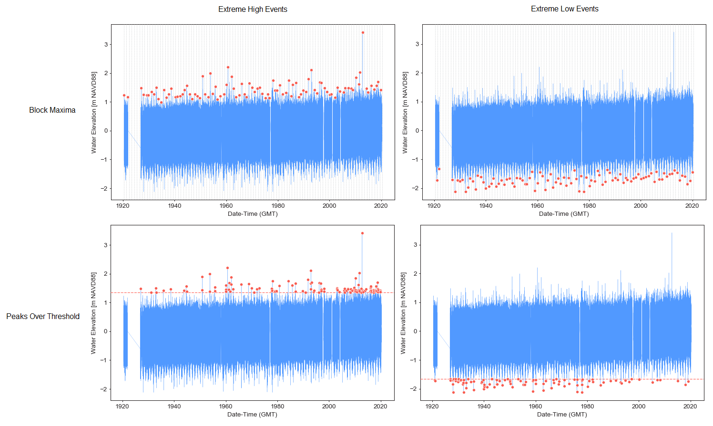
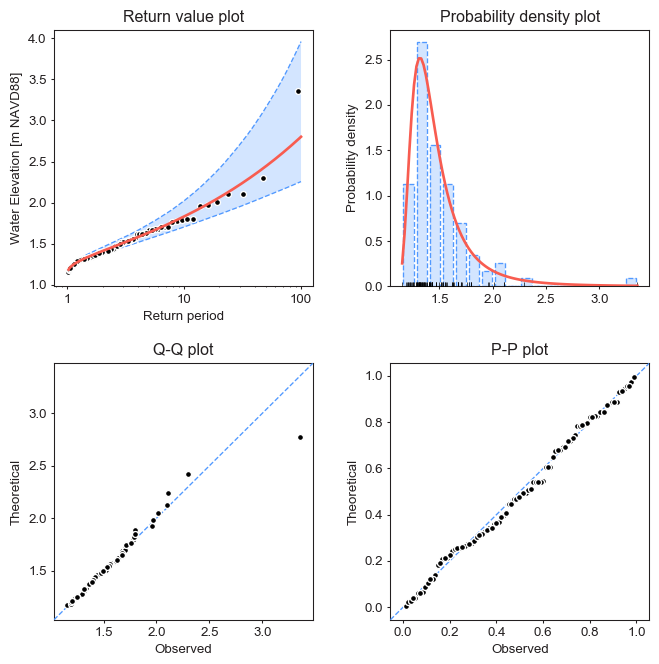

.. role:: bash(code)
   :language: bash

.. role:: python(code)
   :language: python

|build status| |coverage status| |pypi package| |conda version|

.. contents:: Table of Contents

Introduction
============
**pyextremes** is a Python library implementing an easy-to-use extensible framework used to perform `Extreme Value Analysis (EVA) <https://en.wikipedia.org/wiki/Extreme_value_theory>`_. It provides tools necessary to perform typical tasks constituting EVA, such as:

- extraction of extreme events from time series using Block Maxima or Peaks Over Threshold methods
- fitting continuous distributions, such as GEV, GPD, or user specified continous distribution, to the extracted extreme events
- visualization of model performance and goodness-of-fit statistics
- estimation of extreme events of given probability (e.g. 100-year event) and corresponding confidence intervals
- tools assisting with model selection and tuning (block size in BM, threshold in POT)
- (work-in-progress) multivariate extreme value analysis

Framework provided by the **pyextremes** library is easy to use and requires minimum user input to get good results. Its default parameters are configured in compliance with best industry standards (many concepts are based on the "An Introduction to Statistical Modeling of Extreme Values" book by Stuard Coles).

The framework also supports more in-depth configuration for specific cases. It supports all scipy continous distributions and also custom user-made distributions, which are subclasses of :python:`scipy.stats.rv_continuous`. Any parameter of a distribution may be frozen to investigate degenerate models (e.g. GEV->Gumbel). Distributions are fitted to the data using one of the following models:

- :python:`MLE` (default model) - Maximum Likelihood Estimate, uses `scipy <https://www.scipy.org/>`_
- :python:`Emcee` - Markov Chain Monte Calro, uses `emcee <https://emcee.readthedocs.io/en/stable/>`_

**Version:** 1.0.2

**License:** MIT

**E-Mail:** bocharovgeorgii@gmail.com

**Documentation:** see the `Tutorials`_ section

Installation
============
Available via pip:

.. code:: bash

    pip install pyextremes

Via anaconda:

.. code:: bash

    conda install -c conda-forge pyextremes

Or from GitHub directly:

.. code:: bash
   
   pip install git+https://github.com/georgebv/pyextremes

Dependencies
============
**Python version:** 3.7 or later

**Required packages:**

- emcee >= 3.0
- matplotlib
- numpy
- pandas
- scipy

Tutorials
=========
- `Basic usage <https://nbviewer.jupyter.org/github/georgebv/pyextremes-notebooks/blob/master/notebooks/EVA%20basic.ipynb>`_
- Models
- Statistical distributions

Illustrations
=============
Extreme value extraction

|extreme events image|

Model diagnostic

|model diagnostic image|

.. |build status| image:: https://travis-ci.org/georgebv/pyextremes.svg?branch=master
   :target: https://travis-ci.org/georgebv/pyextremes

.. |coverage status| image:: https://codecov.io/gh/georgebv/pyextremes/branch/master/graph/badge.svg
  :target: https://codecov.io/gh/georgebv/pyextremes

.. |pypi package| image:: https://badge.fury.io/py/pyextremes.svg
    :target: https://pypi.org/project/pyextremes/

.. |conda version| image:: https://img.shields.io/conda/vn/conda-forge/pyextremes.svg
    :target: https://anaconda.org/conda-forge/pyextremes

