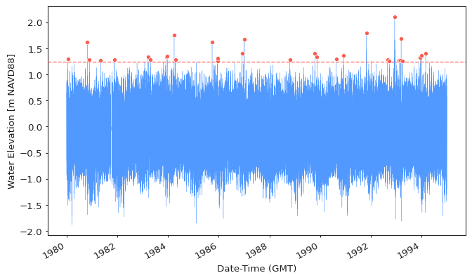

--8<-- "docs/includes/abbreviations.md"

Traditionally EVA recognizes two types of extreme values:

- Block maxima (BM)
- Peaks over threshold (POT)

The BM and POT extreme values are used to apply a statistical model
(GEVD or GPD accordingly) to allow for estimation of extreme events of an arbitrary
probability of exceedance (return period).
Both of these extreme value types represent a valid path of performing EVA and
neither of these is generally better than another.

!!! info
    GEVD and GPD models used for BM and POT extreme value types accordingly
    have a common theoretical basis and should be treated as complementary models,
    not as either/or. More information about why only the GEVD and GPD models
    are recommended to be used is provided in subsequent sections of this tutorial.

## Block Maxima
The Block Maxima extreme values are extracted by selecting a block size
(typically 1 year, also the default in pyextremes), then partitioning time series
of your signal into equal consequtive blocks of this size, and for each block getting
single maximum value (thus, block maxima). The resulting BM time series are then used
to model extreme value behavior using the GEVD model family.
See figure below illustrating this concept:

<figure>
  
</figure>

## Peaks Over Threshold
The Peaks Over Threshold extreme values are extracted by choosing a threshold
and selecting values higher or lower (depends on which extreme process is analyzed)
than the threshold value. The selected values are then declustered by specifying
minimum distance between adjacent clusters (e.g. 24 hours, which means that the model
assumes that clusters of exceedances separater by this distiance or larger are
independent). Selection of threshold and declustering distance is not a trivial task
and has a strong effect on the EVA results.
pyextremes provides a series of tools which help with threshold selection,
these are described further in this tutorial.
See figure below illustrating POT extremes:

<figure>
  
</figure>

## Which Method to Use
One of the most important concepts of EVA is convergenece. What this means practically
is that different models and approaches (as long as they are correctly applied)
should  be converging to the same answer (within reasonable confidence limits).
Because of this, we cannot say that one method is better than another.
Therefore, for a thorough analysis, user is advised to investigate both routes
to make sure that the final answer of the analysis provides a robust estimate.

A general rule of thumb, which is based on years of author's (subjective) experience,
when performing EVA is to do the following:

- Use BM with a reasonable block size to avoid capturing seasonality
(read more in the next section) to get the first estimates and to see how the extremes
behave. Generally, BM is a "simpler" and more stable model which requires very little
input from the user.
- Use POT with a reasonable threshold and declustering parameters
(read more in the next section) to investigate how stable the model is in the region
of target exceedance probabilities (return periods)
and to gain more confidence in your results.

!!! warning "Attention"
    User is **strongly discouraged** from "playing" with the model parameters until
    a desired answer is achieved. EVA is not about getting a perfect estimate
    and a lack of a definitive answer is an answer in itself - it signifies that
    underlying process may be not random
    (e.g. seasonality or some trends were not removed prior to performing EVA),
    that the model is poorly behaved for the data, or that there is simply not enough
    data to provide an accurate answer for a given probability.
    This is typically reflected by wide confidence intervals showing that the answer
    has high uncertainty. For example, your 100-year wind speed may be 50 knots
    (seems reasonable, right?) but the 95% confidence interval shows 10 to 120 knot
    uncertainty range - this clearly indicates that, while your answer
    **happened to appear reasonable**, the model is telling you that you cannot
    make any good faith judgement about the 100-year extreme event when using
    this data and methodology.
