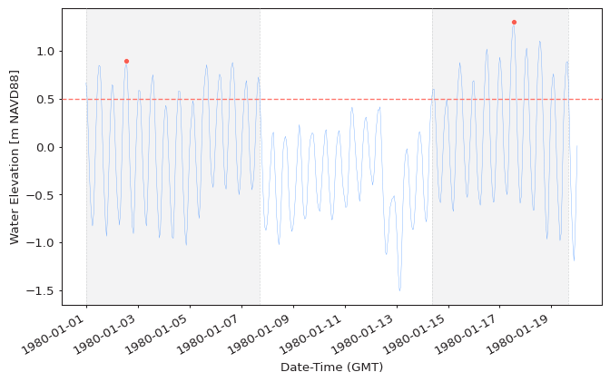
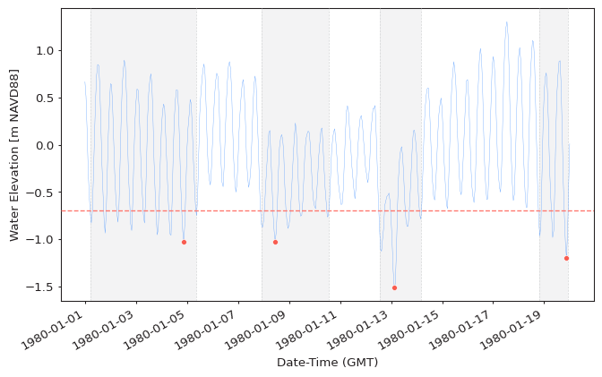

Peaks Over Threshold (POT) extreme values are extracted from time series
by first generating a time series of exceedances by selecting values above
(or below for `#!python extremes_type="low"`) a certain threshold
and then declustering the exceedance time series by identifying clusters
separated by a given time period and then selecting only the highest (lowest)
values within each cluster. Declustering is performed in order to ensure
that these values are IID (independent and identically distributed) which is required
for the corresponding limit distribution to be applicable.
The POT extreme values asymptotically follow the
[Generalized Pareto Distribution](https://en.wikipedia.org/wiki/Generalized_Pareto_distribution)
famliy, according to the
[Pickands–Balkema–De Haan theorem](https://en.wikipedia.org/wiki/Pickands%E2%80%93Balkema%E2%80%93De_Haan_theorem).

<figure>
  
</figure>

## Extracting Extremes

As outlined in the [Read First](1-read-first.md) section of this documentation,
there are multiple ways the same thing can be achieved in `pyextremes`.
The POT extraction function can be accessed via:

- `pyextremes.extremes.peaks_over_threshold.get_extremes_peaks_over_threshold` - the lowest level
- `pyextremes.get_extremes` - general-purpose extreme value extraction function
- `pyextremes.EVA.get_extremes` - helper-class
  (extreme values are not returned by this function, but instead are set
  on the `EVA` instance in the `.extremes` attribute)

The simplest way to extract extreme values using BM method is to use the default
parameters of the `get_extremes` function:

=== "Standalone"

    ```python
    from pyextremes import get_extremes
    from pyextremes.plotting import plot_extremes

    extremes = get_extremes(data, "POT", threshold=0.5, r="12h")
    plot_extremes(
        ts=data,
        extremes=extremes,
        extremes_method="POT",
        extremes_type="high",
        threshold=0.5,
        r="12h",
    )
    ```

=== "Using EVA"

    ```python
    from pyextremes import EVA

    model = EVA(data=data)
    model.get_extremes("POT", threshold=0.5, r="12h")
    model.plot_extremes(show_clusters=True)
    ```

<figure>
  
</figure>

??? note
    You can get the `data` variable referenced above by running the following code:

    ```python
    data = pd.read_csv(
        "battery_wl.csv",
        index_col=0,
        parse_dates=True,
    ).squeeze()
    data = (
        data
        .sort_index(ascending=True)
        .astype(float)
        .dropna()
        .loc[pd.to_datetime("1980/01/01"):pd.to_datetime("1980/01/20")]
    )
    data = (
      data - (data.index.array - pd.to_datetime("1992"))
    ) / pd.to_timedelta("365.2425D") * 2.87e-3
    ```

    `#!python "battery_wl.csv"`
    [can be downloaded here](https://github.com/georgebv/pyextremes-notebooks/tree/master/data).

    All figures shown in this tutorial section were generated using
    [this jupyter notebook](https://nbviewer.jupyter.org/github/georgebv/pyextremes-notebooks/blob/master/notebooks/documentation/extremes/3%20peaks%20over%20threshold.ipynb).

The `get_extremes` function uses the following parameters:

- **ts** - time series (`pandas.Series`) from which the extreme values are extracted
- **method** - extreme value extraction method: `#!python "BM"` for Block Maxima
  and `#!python "POT"` for Peaks Over Threshold.
- **extremes_type** - extreme value type:
  `#!python "high"` for above threshold (default)
  and `#!python "low"` for below threshold.

The following paramters are used only when `#!python method="POT"`:

- **threshold** - threshold value.
- **r** - minimum time distance (window duration) between adjacent clusters. Used
  to decluster exceedances by locating clusters where all exceedances are separated
  by distances no more than `r` and then locating maximum or minimum
  (depends on `extremes_type`) values within each cluster.
  By default `#!python r="24h"` (24 hours).

If we specify all of these parameters then the function would look as:

```python
get_extremes(
    ts=data,
    method="POT",
    extremes_type="high",
    threshold=0.5,
    r="12h",
)
```

## Declustering

As described earlier, declustering is controlled using the `r` argument.
The goal of declustering is to ensure that all extreme values are IID, which is
a requirement for the GPD model to be valid. Shown below is an example of extremes
extracted from the same data and using the same threshold as above, but with a larger
`r` value:

=== "Standalone"

    ```python
    extremes = get_extremes(data, "POT", threshold=0.5, r="24h")
    plot_extremes(
        ts=data,
        extremes=extremes,
        extremes_method="POT",
        extremes_type="high",
        threshold=0.5,
        r="24h",
    )
    ```

=== "Using EVA"

    ```python
    model = EVA(data=data)
    model.get_extremes("POT", threshold=0.5, r="24h")
    model.plot_extremes(show_clusters=True)
    ```

<figure>
  
</figure>

!!! tip
    Declustering value of `#!python r="24h"` was selected as a default value because
    `pyextremes` was developed when working with meteorological phenomena - namely,
    storms. Extreme storm surge and waves are generally caused by a storm event which
    generally doesn't exceed 12-24 hours and, because of this, the assumption of 24-hour
    inter-cluster distance results in a reasonably good separation of independent
    storm events.

    User is advised to select this parameter based on the properties of studied
    phenomena. For example, extreme precipitation events in some regions of the world
    can last for more than several days and, because of this, the default value of
    24 hours would not be adequate for such analysis.

## Peaks Below Threshold

A special case of Peaks Over Threshold is when instead of selecting values above
the threshold we select values below it. Such values can be extracted
by setting the `extremes_type` argument to `#!python "low"`:

=== "Standalone"

    ```python
    extremes = get_extremes(
        data,
        "POT",
        threshold=0.5,
        r="24h",
        extremes_type="low",
    )
    plot_extremes(
        ts=data,
        extremes=extremes,
        extremes_method="POT",
        extremes_type="low",
        threshold=0.5,
        r="24h",
    )
    ```

=== "Using EVA"

    ```python
    model = EVA(data=data)
    model.get_extremes("POT", threshold=0.5, r="24h", extremes_type="low")
    model.plot_extremes(show_clusters=True)
    ```

<figure>
  
</figure>

!!! tip
    The `pyextremes.EVA` class works identically for both peaks over and below
    threshold series and properly reflects (rotates) the data to fit
    statistical distributions.
    This is true as long as the `extremes_type` argument is correctly specified.

!!! warning
    When analyzing POT with `#!python extremes_type="low"` be mindful of your data
    being censored. An example of this would be water level time series - water levels
    cannot go below the seabed and will, therefore, be censored by the seabed elevation.
    Such series would no longer follow the GPD and any results of such analysis
    would be unreliable.
