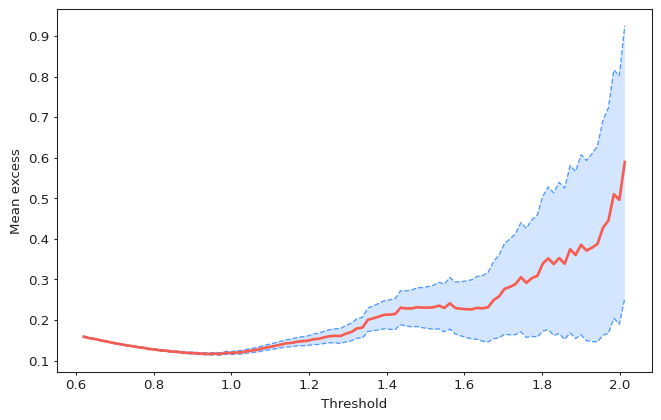
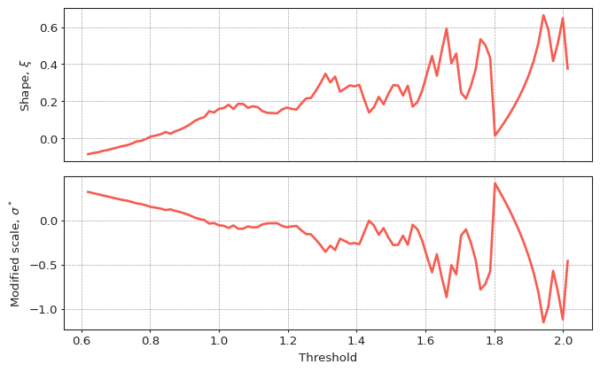
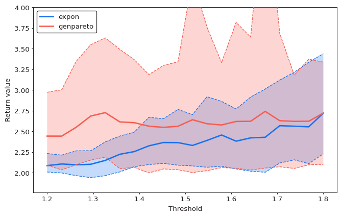
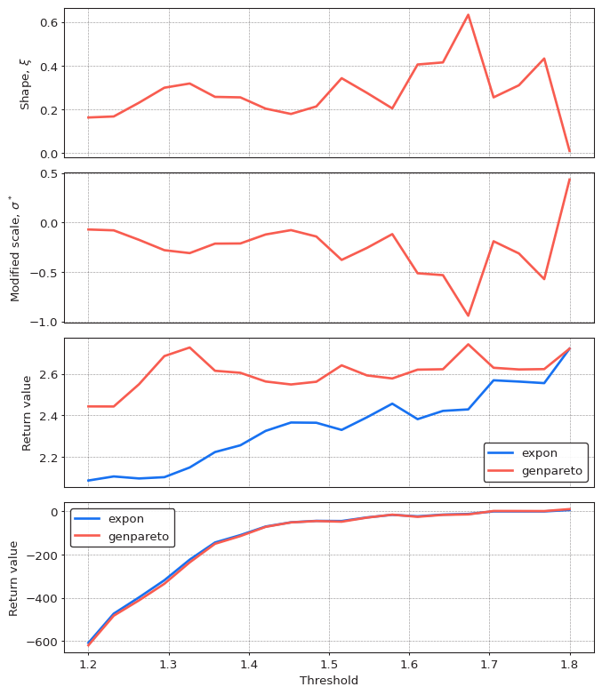
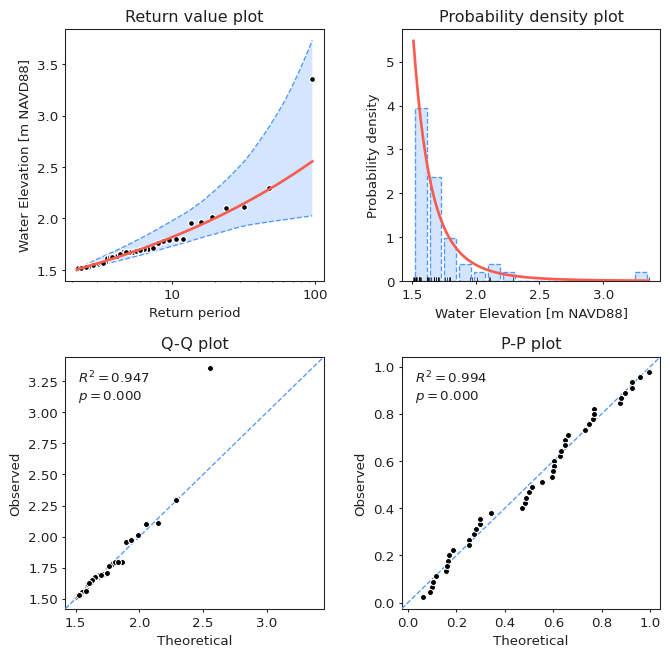

Selection of the threshold value is a very important step because it has the strongest
effect on the results of EVA. The core idea of threshold selection is the same as when
selecting block size in the Block Maxima approach - it is a trade-off between bias
and variance. Larger threshold values produce few extreme values and lead to large
variance in result (confidence bounds), while smaller threshold values generate a sample
which poorly approximates the GPD model. The opposite is true when performing EVA
for extreme low values (`#!python extremes_type="low"`).

The key goal of threshold selection can, therefore, be formulated as follows:

!!! quote "Goal of threshold selection"
    Select the smallest threshold value among those which produce extreme values
    following the limit exceedance model (Generalized Pareto Distribution family).

!!! warning
    Threshold selection is probably the hardest part of Extreme Value Analysis when
    analyzing extreme values obtained using the Peaks Over Threshold method.
    It involves a great deal of subjective judgement and should be performed
    in conjunction with other methods, such as Block Maxima + GEVD, to gain more
    confidence in the validty of obtained results.

## Mean Residual Life

Mean residual life plot plots average excess value over given threshold for a series
of thresholds. The idea is that the mean residual life plot should be approximately
linear above a threshold for which the Generalized Pareto Distribution model is valid.

```python
from pyextremes import plot_mean_residual_life

plot_mean_residual_life(data)
```

<figure>
  
</figure>

??? note
    You can get the `data` variable referenced above by running the following code:

    ```python
    data = pd.read_csv(
        "battery_wl.csv",
        index_col=0,
        parse_dates=True,
    ).squeeze()
    data = (
        data
        .sort_index(ascending=True)
        .astype(float)
        .dropna()
        .loc[pd.to_datetime("1925"):]
    )
    data = (
      data - (data.index.array - pd.to_datetime("1992"))
    ) / pd.to_timedelta("365.2425D") * 2.87e-3
    ```

    `#!python "battery_wl.csv"`
    [can be downloaded here](https://github.com/georgebv/pyextremes-notebooks/tree/master/data).

    All figures shown in this tutorial section were generated using
    [this jupyter notebook](https://nbviewer.jupyter.org/github/georgebv/pyextremes-notebooks/blob/master/notebooks/documentation/extremes/4%20threshold%20selection.ipynb).

As seen in the figure above, exceedance values are approximately linear between
threshold values of 1.2 and 1.8. This provides a range of threshold values which can
be further investigated using other methods.

The `plot_mean_residual_life` function uses the following parameters:

- **ts** - time series (`pandas.Series`) from which the extreme values are extracted
- **thresholds** - array of threshold for which the plot is displayed. By default
  100 equally-spaced thresholds between 90th (10th if `#!python extremes_type="high"`)
  percentile and 10th largest (smallest if `#!python extremes_type="low"`)
  value in the series.
- **extremes_type** - extreme value type:
  `#!python "high"` for above threshold (default)
  and `#!python "low"` for below threshold.
- **alpha** - confidence interval width in the range (0, 1), by default it is 0.95.
  If None, then confidence interval is not shown.
- **ax** - matplotlib Axes object. If provided, then the plot is drawn on this axes.
  If None (default), new figure and axes are created
- **figsize** - figure size in inches in format (width, height).
  By default it is (8, 5).

!!! note
    In author's (subjective) opinion this is the least useful technique among those
    listed in this section because mean residual life plots are very hard to interpret.

## Parameter Stability

Parameter stability plot shows how shape and modified scale parameters of the
Generalized Pareto Distribution change over a range of threshold values.
The idea is that these parameters should be stable (vary by small amount) within
a range of valid thresholds.

```python
from pyextremes import plot_parameter_stability

plot_parameter_stability(data)
```

<figure>
  
</figure>

As seen in the figure above, these parameters appear to stabilize around threshold
value of 1.2 with subsequent values having higher variance due to smaller number
of exceedances.

The `plot_parameter_stability` function uses the following parameters:

- **ts** - time series (`pandas.Series`) from which the extreme values are extracted
- **thresholds** - array of threshold for which the plot is displayed. By default
  100 equally-spaced thresholds between 90th (10th if `#!python extremes_type="high"`)
  percentile and 10th largest (smallest if `#!python extremes_type="low"`)
  value in the series.
- **r** - minimum time distance (window duration) between adjacent clusters. Used
  to decluster exceedances by locating clusters where all exceedances are separated
  by distances no more than `r` and then locating maximum or minimum
  (depends on `extremes_type`) values within each cluster.
  By default `#!python r="24h"` (24 hours).
- **extremes_type** - extreme value type:
  `#!python "high"` for above threshold (default)
  and `#!python "low"` for below threshold.
- **alpha** - confidence interval width in the range (0, 1), by default it is 0.95.
  If None, then confidence interval is not shown.
- **n_samples** - number of bootstrap samples used to estimate confidence
  interval bounds (default=100). Ignored if `alpha` is None.
- **axes** - tuple with matplotlib Axes (ax_shape, ax_scale) for shape and scale values.
  If None (default), new figure and axes are created.
- **figsize** - figure size in inches in format (width, height).
  By default it is (8, 5).
- **progress** - if True, shows tqdm progress bar. By default False.
  Requires `tqdm` package.

## Return Value Stability

An extension of the previous technique is to investigate stability of a target return
value with a pre-defined return period over a range of thresholds. This technique
provides a more intuitive metric of model stability. Let's plot it for the range of
thresholds identified earlier:

```python
from pyextremes import plot_return_value_stability

plot_return_value_stability(
    data,
    return_period=100,
    thresholds=np.linspace(1.2, 1.8, 20),
    alpha=0.95,
)
```

<figure>
  
</figure>

As seen in the figure above, the model is very stable for threshold values above 1.4.

The `plot_return_value_stability` function uses the following parameters:

- **ts** - time series (`pandas.Series`) from which the extreme values are extracted
- **return_period** - return period given as a multiple of `return_period_size`.
- **return_period_size** - size of return period. Same as the `r` argument.
  By default this is 1 year.
- **thresholds** - array of threshold for which the plot is displayed. By default
  100 equally-spaced thresholds between 90th (10th if `#!python extremes_type="high"`)
  percentile and 10th largest (smallest if `#!python extremes_type="low"`)
  value in the series.
- **r** - minimum time distance (window duration) between adjacent clusters. Used
  to decluster exceedances by locating clusters where all exceedances are separated
  by distances no more than `r` and then locating maximum or minimum
  (depends on `extremes_type`) values within each cluster.
  By default `#!python r="24h"` (24 hours).
- **extremes_type** - extreme value type:
  `#!python "high"` for above threshold (default)
  and `#!python "low"` for below threshold.
- **distributions** - list of distributions for which the plot is produced.
  By default these are "genpareto" and "expon".
  A distribution must be either a name of distribution from `scipy.stats`
  or a subclass of scipy.stats.rv_continuous.
  See [scipy.stats documentation](https://docs.scipy.org/doc/scipy/reference/stats.html)
- **alpha** - confidence interval width in the range (0, 1), by default it is 0.95.
  If None, then confidence interval is not shown.
- **n_samples** - number of bootstrap samples used to estimate confidence
  interval bounds (default=100). Ignored if `alpha` is None.
- **ax** - matplotlib Axes object. If provided, then the plot is drawn on this axes.
  If None (default), new figure and axes are created
- **figsize** - figure size in inches in format (width, height).
  By default it is (8, 5).
- **progress** - if True, shows tqdm progress bar. By default False.
  Requires `tqdm` package.

!!! warning
    This is the most dangerous threshold selection teqchnique presented in this section.
    It can be abused by selecting a threshold value which gives a desired result.
    Results of such analysis would be biased and invalid. Analyst should honestly
    present results of their analysis and high variance in answer should be considered
    a valuable result as well - it indicates that available data cann be used to obtain
    reliable results and that there is high uncertainty in the analyzed process.

## Putting it all Together

`pyextremes` provides a convenience function to put all of the above together.
It also adds an additional plot - AIC curve indicating relative model performance.
The AIC curve should not be used as a threshold selection tool because it will always
have the same logarithmic shape. Instead, it should guide the user as to which model
(e.g. GEVD or Exponential) should be preferred for a given threshold.

```python
from pyextremes import plot_threshold_stability

plot_threshold_stability(
    data,
    return_period=100,
    thresholds=np.linspace(1.2, 1.8, 20),
)
```

<figure>
  
</figure>

Based on the figures shown earlier, one may conclude that the valid threshold may lie
between 1.4 and 1.6. A decision was made to select threshold value of 1.5.

The `plot_threshold_stability` function uses the following parameters:

- **ts** - time series (`pandas.Series`) from which the extreme values are extracted
- **return_period** - return period given as a multiple of `return_period_size`.
- **return_period_size** - size of return period. Same as the `r` argument.
  By default this is 1 year.
- **thresholds** - array of threshold for which the plot is displayed. By default
  100 equally-spaced thresholds between 90th (10th if `#!python extremes_type="high"`)
  percentile and 10th largest (smallest if `#!python extremes_type="low"`)
  value in the series.
- **r** - minimum time distance (window duration) between adjacent clusters. Used
  to decluster exceedances by locating clusters where all exceedances are separated
  by distances no more than `r` and then locating maximum or minimum
  (depends on `extremes_type`) values within each cluster.
  By default `#!python r="24h"` (24 hours).
- **extremes_type** - extreme value type:
  `#!python "high"` for above threshold (default)
  and `#!python "low"` for below threshold.
- **distributions** - list of distributions for which the plot is produced.
  By default these are "genpareto" and "expon".
  A distribution must be either a name of distribution from `scipy.stats`
  or a subclass of scipy.stats.rv_continuous.
  See [scipy.stats documentation](https://docs.scipy.org/doc/scipy/reference/stats.html)
- **alpha** - confidence interval width in the range (0, 1), by default it is 0.95.
  If None, then confidence interval is not shown.
- **n_samples** - number of bootstrap samples used to estimate confidence
  interval bounds (default=100). Ignored if `alpha` is None.
- **ax** - matplotlib Axes object. If provided, then the plot is drawn on this axes.
  If None (default), new figure and axes are created
- **figsize** - figure size in inches in format (width, height).
  By default it is (8, 5).
- **progress** - if True, shows tqdm progress bar. By default False.
  Requires `tqdm` package.

Results of selecting the threshold value 1.5 are shown below:

<figure>
  
</figure>
