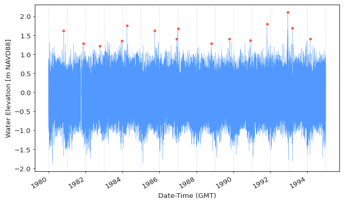
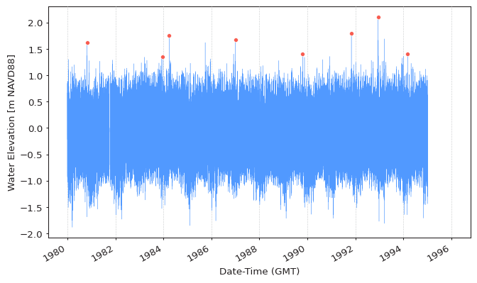
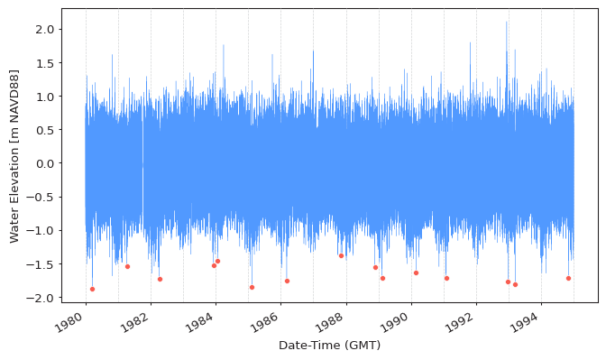

Block Maxima or Minima (BM) extreme values are extracted from time series
by partitioning it into blocks (segments) of equal duration (e.g. 1 year)
and locating maximum or minimum values within each block.
Block maxima extreme values asymptotically follow the
[Generalized Extreme Value Distribution](https://en.wikipedia.org/wiki/Generalized_extreme_value_distribution)
family, according to the
[Fisher–Tippett–Gnedenko theorem](https://en.wikipedia.org/wiki/Fisher%E2%80%93Tippett%E2%80%93Gnedenko_theorem).
This theorem demonstrates that the GEVD family is the only possible
limit for the block maxima extreme values.

<figure>
  
</figure>

## Extracting Extremes
As outlined in the [Read First](../read-first.md) section of this documentation,
there are multiple ways the same thing can be achieved in `pyextremes`.
The BM extraction function can be accessed via:

- `pyextremes.extremes.block_maxima.get_extremes_block_maxima` - the lowest level
- `pyextremes.get_extremes` - general-purpose extreme value extraction function
- `pyextremes.EVA.get_extremes` - helper-class
  (extreme values are not returned by this function, but instead are set
  on the `EVA` instance in the `.extremes` attribute)

The simplest way to extract extreme values using BM method is to use the default
parameters of the `get_extremes` function:

=== "Standalone"

    ```python
    from pyextremes import get_extremes
    from pyextremes.plotting import plot_extremes

    extremes = get_extremes(data, "BM")
    plot_extremes(
        ts=data,
        extremes=extremes,
        extremes_method="BM",
        extremes_type="high",
        block_size="365.2425D",
    )
    ```

=== "Using EVA"

    ```python
    from pyextremes import EVA

    model = EVA(data=data)
    model.get_extremes("BM")
    model.plot_extremes()
    ```

<figure>
  
</figure>

??? note
    You can get the `data` variable referenced above by running the following code:

    ```python
    data = pd.read_csv(
        "battery_wl.csv",
        index_col=0,
        parse_dates=True,
        squeeze=True,
    )
    data = (
        data
        .sort_index(ascending=True)
        .astype(float)
        .dropna()
        .loc[pd.to_datetime("1980"):pd.to_datetime("1995")]
    )
    data = (
      data - (data.index.array - pd.to_datetime("1992"))
    ) / pd.to_timedelta("365.2425D") * 2.87e-3
    ```

    `#!python "battery_wl.csv"`
    [can be downloaded here](https://github.com/georgebv/pyextremes-notebooks/tree/master/data).

    All figures shown in this tutorial section were generated using
    [this jupyter notebook](https://nbviewer.jupyter.org/github/georgebv/pyextremes-notebooks/blob/master/notebooks/documentation/extremes/2%20block%20maxima.ipynb).

The `get_extremes` function uses the following parameters:

- **ts** - time series (`pandas.Series`) from which the extreme values are extracted
- **method** - extreme value extraction method: `#!python "BM"` for Block Maxima
  and `#!python "POT"` for Peaks Over Threshold.
- **extremes_type** - extreme value type:
  `#!python "high"` for maxima (default) and `#!python "low"` for minima

The following paramters are used only when `#!python method="BM"`:

- **block_size** - block size, by default `#!python "365.2425D"`.
  Internally is converted using the `#!python pandas.to_timedelta` function.
- **errors** - specifies what to do when a block is empty (has no values).
  `#!python "raise"` (default) raises error, `#!python "ignore"` skips such blocks
  (not recommended), and `#!python "coerce"` sets values for such blocks as average
  of extreme values in other blocks.
- **min_last_block** - minimum data availability ratio (0 to 1)
  in the last block. If the last block is shorter than this ration
  (e.g. 0.25 corresponds to 3 months for a block size of 1 year) then it is not used
  to get extreme values. This argument is useful to avoid situations when the last
  block is very small. By default this is `#!python None`, which means that last
  block is always used.

If we specify all of these parameters then the function would look as:

```python
get_extremes(
    ts=data,
    method="BM",
    extremes_type="high",
    block_size="365.2425D",
    errors="raise",
    min_last_block=None,
)
```

## Selecting Block Size
Like with most choices in statistics, selection of block size involves making a
trade-off between bias and variance: blocks that are too small mean that
approximation by the limit model (GEVD) is likely to be poor,
leading to bias in estimation and extrapolation; large blocks generate few block
maxima/minima, leading to large estimation variance. Pragmatic considerations
often lead to the adoption of blocks of length one year. (Coles, 2004)

An important thing to consider is also the physical nature of investigated signal.
Many meteorological events (e.g. snowfall, rain, waves) are seasonal and, therefore,
selection of block sizes smaller than 1-year would result in significant bias due to
blocks no longer being equivalent
(e.g. summer blocks are nearly guaranteed to have no snow).

We can specify different block size using the `block_size` argument. Using the same
data as above but with a block size of 2 years we get:

=== "Standalone"

    ```python
    extremes = get_extremes(
        ts=data,
        method="BM",
        block_size=pd.to_timedelta("365.2425D") * 2,
    )
    plot_extremes(
        ts=data,
        extremes=extremes,
        extremes_method="BM",
        extremes_type="high",
        block_size=pd.to_timedelta("365.2425D") * 2,
    )
    ```

=== "Using EVA"

    ```python
    model = EVA(data=data)
    model.get_extremes("BM", block_size=pd.to_timedelta("365.2425D") * 2)
    model.plot_extremes()
    ```

<figure>
  
</figure>

## Block Minima
Block minima is fully equivalent to block maxima in the way it is extracted.
Block minima can be extracted by setting the `extremes_type` argument
to `#!python "low"`:

=== "Standalone"

    ```python
    extremes = get_extremes(
        ts=data,
        method="BM",
        extremes_type="low",
    )
    plot_extremes(
        ts=data,
        extremes=extremes,
        extremes_method="BM",
        extremes_type="high",
        block_size="365.2425D",
    )
    ```

=== "Using EVA"

    ```python
    model = EVA(data=data)
    model.get_extremes("BM", extremes_type="low")
    model.plot_extremes()
    ```

<figure>
  
</figure>

!!! tip
    The `pyextremes.EVA` class works identically for both maxima and minima series and
    properly reflects (rotates) the data to fit statistical distributions.
    This is true as long as the `extremes_type` argument is correctly specified.

!!! warning
    When analyzing block minima be mindful of your data being censored.
    An example of this would be water level time series - water levels cannot go
    below the seabed and will, therefore, be censored by the seabed elevation.
    Such series would no longer follow the GEVD and any results of such analysis
    would be unerliable.
